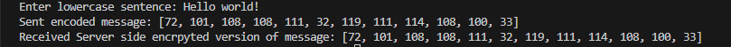
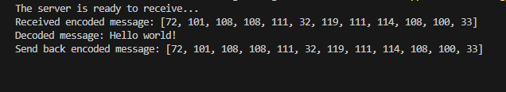

# Socket-Programming-TCP
# CyberPunk
 

## Table of Contents
* [Description](#description)
* [Installation](#installation)
* [Usage](#usage)
 * [Contributors](#contributors)
 * [Images](#images)

# Description
-This is a basic application layer in socket programming. The goal was to send an encoded message to the sever to read and decode then send back the encoded message to the client. 

# Installation
In order to install the project you will need the following: 
- Updated version of python
- IDE with python capabilities 
- Optional: Extention for VS code Users to read Python files

To start: 
Clone the repository on GitHub then open Git on your local machine. First find a location of your choice on your computer that you want the folder to be in.
- To change working directory, use the command cd followed by a folder or cd.. to move back  
- Using the command git clone and adding the cloned directory, you will have a copy of this project

# Usage 
The purpose behind this project was to simulate a basic TCP transport service using socket programming 

# Contributors
- WixkedLuck

# Images

Client side initial input, sent message and recieved responce:

Server side recieved encoded message, decoded message and sent responce:

